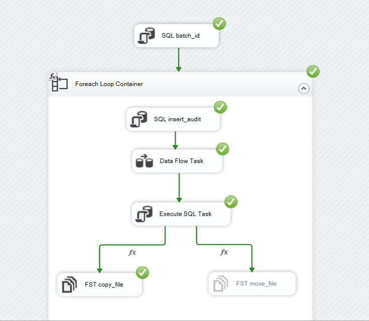
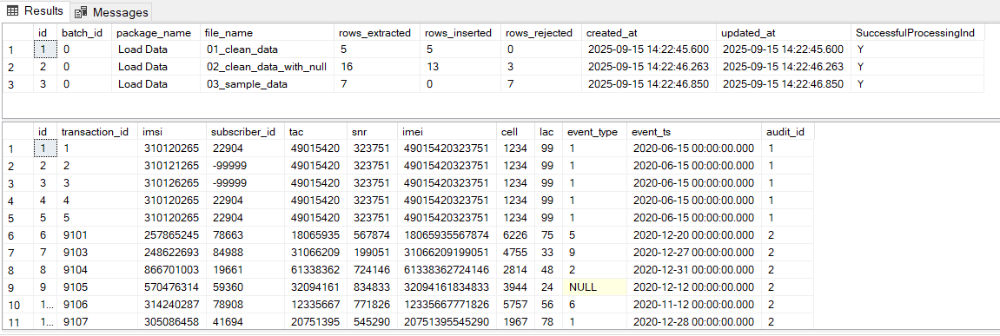

# Telecom ETL Case Study

##  Overview
This project is an **ETL case study** implemented with **SQL Server Integration Services (SSIS)**.  
The idea is inspired by the [Garage Education series by Eng. Mostafa Alaa] (implemented in Scala), but here it is re-built using **SQL Server + SSIS**.

---

##  Project Structure
- **sql/** → SQL scripts (table creation + transformations).
- **source_files/** → Original CSV source files.
- **processed_files/** → Processed/archived files after ETL.
- **images/** → Screenshots (ETL package design + audit results).
- **SSIS/** → SSIS project package (`.dtsx` file).

---

##  ETL Workflow
1. **Extract**  
   - CSV files are received every 5 minutes into a source folder.  

2. **Transform**  
   - Apply data quality rules and transformations:  
     - `IMSI` → reject if null.  
     - Lookup `subscriber_id` from IMSI reference (set `-99999` if missing).  
     - `IMEI` → split into `TAC` (first 8 chars) and `SNR` (last 6 chars).  
     - Validate timestamp format (`YYYY-MM-DD HH:MM:SS`).  
     - Reject record if any mandatory column is invalid.  

3. **Load**  
   - Insert valid records into **fact_transaction** table.  
   - Insert rejected records into **rejected_records** table (with file name).  
   - Insert audit information into **audit_log** table.  

---

## 📊 Audit Example
| file_name                 | rows_extracted | rows_inserted | rows_rejected |
|----------------------------|----------------|---------------|---------------|
| 01_clean_data.csv          | 5              | 5             | 0             |
| 02_clean_data_with_null.csv| 16             | 13            | 3             |
| 03_sample_data.csv         | 7              | 7             | 0             |

---

##  Screenshots
### ETL Package Design

### Audit Results

---

## ▶️ How to Run
1. Execute `sql/create_tables.sql` to create the required database tables.  
2. Place CSV source files inside the `source_files/` directory.  
3. Run the SSIS package (`TelecomETL.dtsx`).  
4. After execution:  
   - Valid records → inserted into **fact_transaction**.  
   - Invalid/rejected records → inserted into **rejected_records**.  
   - File moved to `processed_files/`.  
   - Audit log updated with processing summary.  

---

## 👨‍💻 Author
Implemented by: Saeed Elgharbawy
